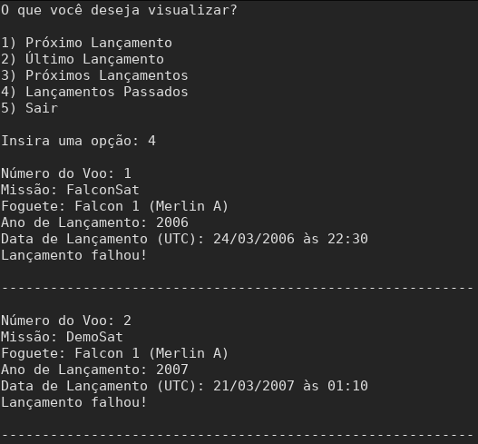
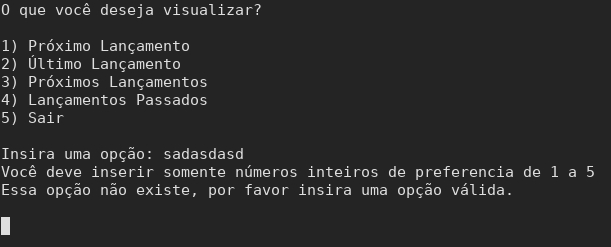

## TBL 1 - Fase 3

## 1. Walkthrough

É uma técnica aplicada em grupo, onde o autor leva a equipe através de uma execução simulada ou manual do produto utilizando critérios definidos, é interessante de ser aplicada, pois, além do autor do programa, diversas pessoas estão envolvidas no processo, oferecendo diferentes pontos de vista sobre o artefato. Esse procedimento frequentemente expõe uma grande quantidade de erros e suas localizações precisas no código, permitindo que sejam corrigidos de uma só vez.

O Walkthrough pode ser feito de maneira automática, estática ou funcional, geralmente o custo do uso desta técnica pode váriar de acordo com a quantidade de pessoas envolvidas, tamanho e complexidade do projeto e artefatos envolvidos, geralmente classificada com custo médio.

A técnica é interessante, pois fornece uma base para questionar a lógica do programador e ajudar a identificar problemas no sistema.


## 2. Pseudocódigo

### spaceX.py    

```
    IMPORT Connect DE connections

    NEXT_LAUNCH = 1
    LATEST_LAUNCH = 2
    UPCOMING_LAUNCHES = 3
    PAST_LAUNCHES = 4

    WHILE 1 DO
        PRINT ("O que você deseja visualizar?")
        PRINT ("1) Próximo Lançamento")  
        PRINT ("2) Último Lançamento")   
        PRINT ("3) Próximos Lançamentos")  
        PRINT ("4) Lançamentos Passados")
        PRINT ("5) Sair")

        PRINT ("Insira uma opção: ")
        SCAN(option) 
        
        IF option != INTEIRO THEN
            PRINT ("Você deve inserir somente números inteiros de preferencia de 1 a 5")
            option = 0
        END IF

        IF option < 1 OU option > 5 THEN
            PRINT ("Essa opção não existe, por favor insira uma opção válida.")
            clean(3)
        END IF
        ELSE
            IF option == 5 THEN
                END_LOOP
            END IF
            ELSE
                show_result(option)
                PRINT ("Deseja sair da aplicação? (S/N): ")
                SCANF(answer)
                IF answer[0] == "s" THEN
                    END_LOOP
                END IF
                clean(1)
            END ELSE
        END ELSE
    END WHILE

    FUNCTION show_result(option)
    BEGIN
        IF option == NEXT_LAUNCH THEN
            next_launch()
        END IF
        ELSE IF option == LATEST_LAUNCH THEN
            latest_launch()
        END ELSE IF
        ELSE IF option == UPCOMING_LAUNCHES THEN
            upcoming_launches()
        END ELSE IF
        ELSE IF option == PAST_LAUNCHES THEN
            past_launches()
        END ELSE IF
        ELSE
            PRINT ("Opção invalida")
        END ELSE
    END
    FUNCTION clean(seconds)
    BEGIN
        ESPERA(seconds)
        
        IF PLATAFORMA == WINDOWNS THEN
            LIMPAR_TELA_WINDOWNS()
        END IF
        ELSE
            LIMPAR_TELA_OUTRA_PLATAFORMA()
        END ELSE
    END

    FUNCTION close()
    BEGIN
        PRINT("Finalizando o programa...")
        ESPERE(1)
    END

    FUNCTION next_launch()
    BEGIN
        connection = Connect("https://api.spacexdata.com/v3/launches/next")
        PRINT(connection.result)
    END

    FUNCTION upcoming_launches()
    BEGIN
        connection = Connect("https://api.spacexdata.com/v3/launches/upcoming")
       FOR EACH result IN connection.result
            PRINT(result)
            PRINT("----------------------------------------------------------\n")
        END FOR
    END

    FUNCTION latest_launch()
    BEGIN
        connection = Connect("https://api.spacexdata.com/v3/launches/latest")
        PRINT(connection.result)
    END

    FUNÇÃO past_launches():
    BEGIN
        connection = Connect("https://api.spacexdata.com/v3/launches/past")
        FOR EACH result IN connection.result
            PRINT(result)
            PRINT("----------------------------------------------------------\n")
    END

```


### api_connection.py

```
IMPORT launch FROM models


CLASS Connect
BEGIN
    constructor(url, header<-None, params<-none)
    IF header != NIL then
        self.__headers <- headers
    END IF
    ELSE then
        header <- {'Accept': 'application/json'}
    END ELSE

    try
    BEGIN

    IF params != NIL then
        self.__response <- request.get(url, self.__headers, params=params)
    END IF
    ELSE then
        self.__response <- requests.get(url, self.__headers)
    END ELSE

    self.__result <- self.__response.json()

    END

    except
    BEGIN
        print("Ocorreu um erro na comunicação com a API SpaceX")
    END


    FUNCTION result():
    BEGIN
        IF result type == dict type then
            return Launch(
                flight_number<-self.__result.get('flight_number'),
                mission_name<-self.__result.get('mission_name'),
                rocket<-self.__result.get('rocket').get('rocket_name'),
                rocket_type<-self.__result.get('rocket').get('rocket_type'),
                launch_success<-self.__result.get('launch_success'),
                launch_date<-self.__result.get('launch_date_utc'),
                launch_year<-self.__result.get('launch_year')
            )
        END IF

        launchs <- []

        FOR each result in self.__result
            launchs.append(
                Launch(
                    flight_number<-result.get('flight_number'),
                    mission_name<-result.get('mission_name'),
                    rocket<-result.get('rocket').get('rocket_name'),
                    rocket_type<-result.get('rocket').get('rocket_type'),
                    launch_success<-result.get('launch_success'),
                    launch_date<-result.get('launch_date_utc'),
                    launch_year<-result.get('launch_year')
                )
            )
        END FOR

        return launchs
    END

    FUNCTION response
    BEGIN
        return self.__response
    END

END
```

### launch.py

```
FROM datetime IMPORT datetime

CLASS launch
BEGIN

    FUNCTION init(flight_number, mission_name, rocket,
                 rocket_type, launch_success,
                 launch_year, launch_date)
    BEGIN

        flight_number <- flight_number
        mission_name <- mission_name
        launch_date <- launch_date
        launch_year <- launch_year
        rocket <- rocket
        rocket_type <- rocket_type
        launch_success <- launch_success
    
    END

    FUNCTION str
    BEGIN

        IF launch_success != NIL then
            print( flight_number, mission_name, rocket,
             launch_year, launch_date, launch_success
        END IF
        
        print( flight_number, mission_name, rocket,
             launch_year, launch_date, launch_success

    END

    FUNCTION flight_number
    BEGIN

        print ("Número do Voo", flight_number)

    END

    FUNCTION mission_name
    BEGIN

        print( "Missão", mission_name)

    END
    
    FUNCTION launch_date
    BEGIN

        date <- datetime.(launch_date)

        print( "Data de Lançamento (UTC):",date)

    END
    
    FUNCTION launch_year
    BEGIN

        print( "Ano de Lançamento",launch_year)

    END

    
    FUNCTION rocket
    BEGIN

        print( "Foguete",rocket,rocket_type)

    END

    
    FUNCTION launch_success
    BEGIN

        IF launch_success == TRUE then
            print( "Lançamento realizado com sucesso!")
        END IF

        ELSE then
            print( "Lançamento falhou!")
        END ELSE
    
    END

END
```

## 3. Simulação
```bash
-- Inicia programa "spaceX.py" --

:output do programa
"O que você deseja visualizar?
"
"1) Próximo Lançamento
"2) Último Lançamento
"3) Próximos Lançamentos
"4) Lançamentos Passados
"5) Sair
"
"Insira uma opção:
:fim output

>input do usuário = 2
  $ atribui à variavel "option" o valor 2
  $ passa pelo primeiro if, cujo qual têm o papel de garantir que a entrada é válida (um número inteiro)
  $ passa pelo segundo if, cujo qual têm o papel de garantir que o número escolhido é valido (entre 1 e 5)
  $ entra no else
  $ passa pelo if, que têm o papel de finalizar o programa caso o input do usuário tenha sido 5
  $ entra no else
  $ chama a função "show_result()" com a opção selecionada pelo usuário (2)
    $ passa pelo primeiro if, que tem o objetivo de mostrar o próximo lançamento
    $ entra no segundo if, que corresponde à entrada do usuário: mostrar o último lançamento
    $ chama a função "latest_launch()"
      $ consome a api da spaceX
      $ retorna o resultado 

:output do programa
"
"Número do Voo: 83
"Missão: Amos-17
"Foguete: Falcon 9 (FT)
"Ano de Lançamento: 2019
"Data de Lançamento (UTC): 06/08/2019 às 22:52
"Lançamento realizado com sucesso!
"
:fim output

      $ fim da função "latest_launch()"
    $ fim da função "show_result()"
  $ solicita se o usuário quer continuar a interagir com o programa ou sair
:output do programa
"Deseja sair da aplicação? (S/N):
:fim output

>input do usuário = "S"

  $ entra no primeiro if, que termina a execução do programa 
:output do programa
"Finalizando o programa...
:fim output

-- Fim do programa "spaceX.py" --
```

## 4. Funcionamento do programa

O programa não apresentou erros de execução durante sua execução quando conectado a internet.

* Durante a execução do programa, ao selecionarmos alguma das opções 3 ou 4, o programa dá a sensação ao usuário de que está travado, mas na verdade está buscando as informações requisitadas na API, então uma simples mensagem de "carregando" ou "buscando" ajudaria muito na percepção do usuário sobre o programa.

Durante a execução do programa sem conexão com internet

* Durante a execução do programa, ao selecionarmos quaisquer opções exceto a de finalizar o programa, temos um feedback de falha de comunicação com a api, mas ao mesmo tempo temos um erro de atributo da classe Connect, o que para um possível usuário deste software sem conhecimentos em programação ou até mesmo um programador que não possui acesso ao código, ou não conhece o código, não conseguiria resolver este problema.

Execução com entradas incorretas

* Durante a execução do programa, ao colocar entradas não esperadas pelo programa, ele consegue fazer o tratamento das entradas e avisa ao usuário que a entrada está incorreta, mas ao dar esta mensagem, o programa leva alguns segundo para retornar o usuário à tela principal, o que pode gerar desconforto, até mesmo por que o programa retorna sozinho, e por um descuido do usuário, ele pode desviar o olhar e acabar não vendo a mensagem de erro.

## 5. Execução do programa

### Execução com internet

- Opção 1:


- Opção 2:


- Opção 3:


- Opção 4:



- Opção 5:


### Execução sem internet


- Opção 2:


- Opção 3:


- Opção 4:


- Opção 5:


### Execução com entradas incorretas



